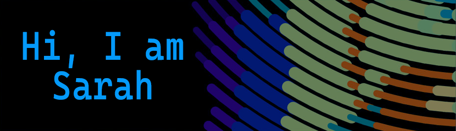

I am a skilled web developer with many years experience in open-source web applications like PHP and MySQL. I recently completed an intensive boot camp in Web Development at Ironhack, reigniting my passion for coding and gaining experience in the MERN (MongoDB, Express, React and Node) framework.

### What I Like: 
working as part of a collaborative team.
### More about me: 
attention to detail, zest for learning and trying new things and the ability to make people around me smile and laugh.
### I am: 
dependable and a detail-oriented person, meticulous and highly efficient.

### Languages and Tools

