I am a skilled web developer with many years experience in open-source web applications like PHP and MySQL. I recently completed an intensive boot camp in Web Development at Ironhack, reigniting my passion for coding and gaining experience in the MERN (MongoDB, Express, React and Node) framework.

## Recent Projects

### TechTribe
TechTribe is a CRM for Lead Management. The project was created and implemented for a Hackathon run by innoscripta. Our team placed in 2nd place and I couldn't be more proud of our efforts!

Frontend: HTML, CSS, React, Tailwind  
Backend: PHP, Laravel, MySQL

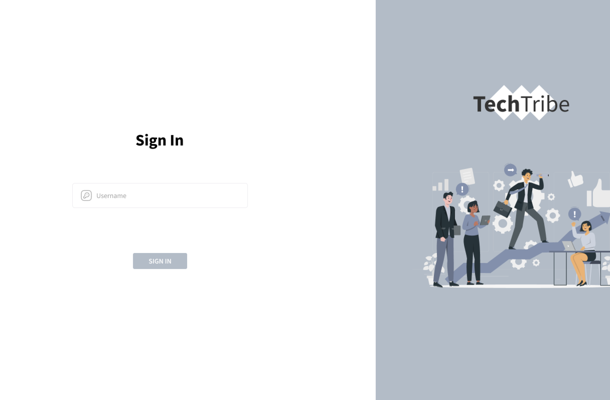 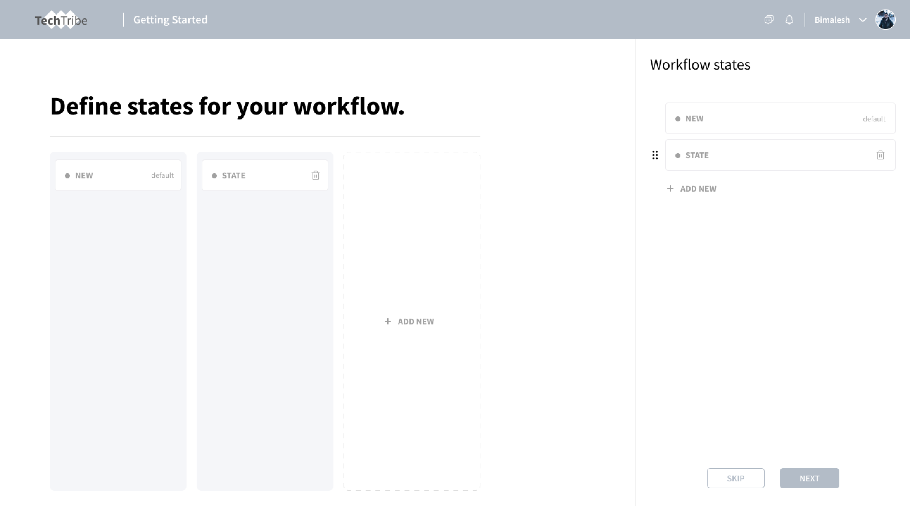 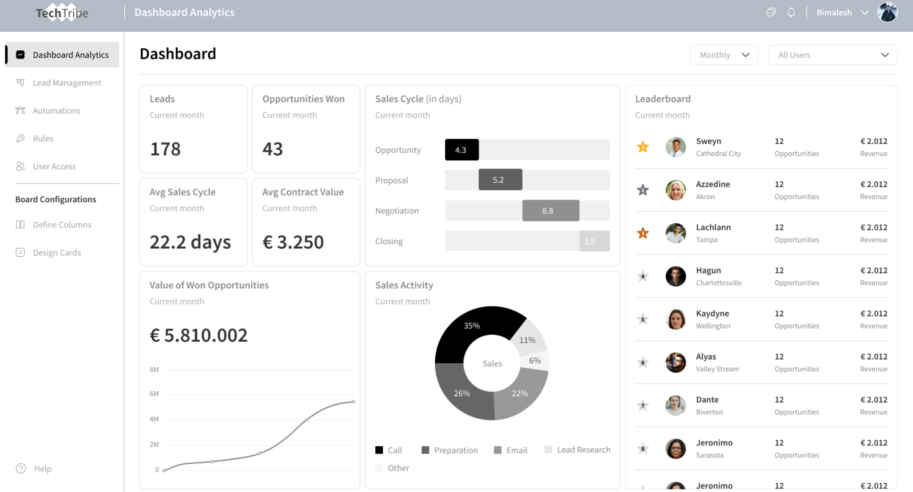

### ecoMarts - Eco-friendly and Sustainable Products
ecoMarts is a MERN e-commerce platform that focuses on offering eco-friendly and sustainable products.

Frontend: HTML, CSS, React, Bootstrap  
Backend: MongoDB (Compass / Atlas), Mongoose, Express, Node.js, Cloudinary

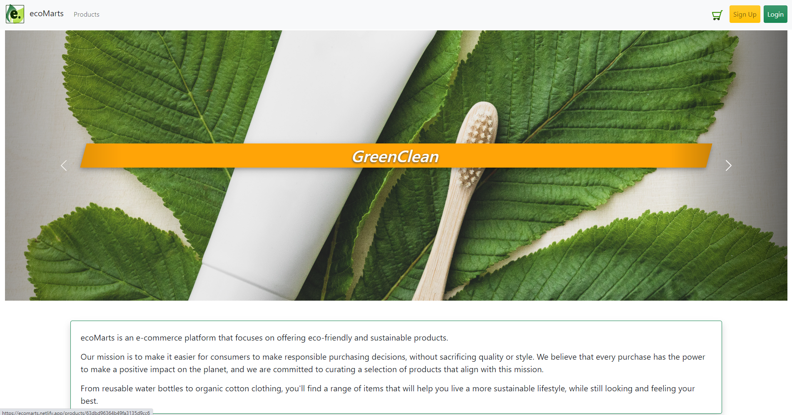 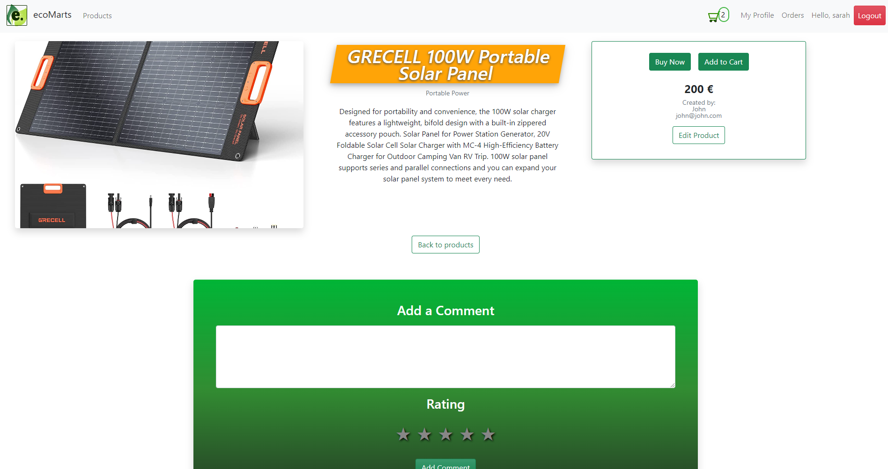 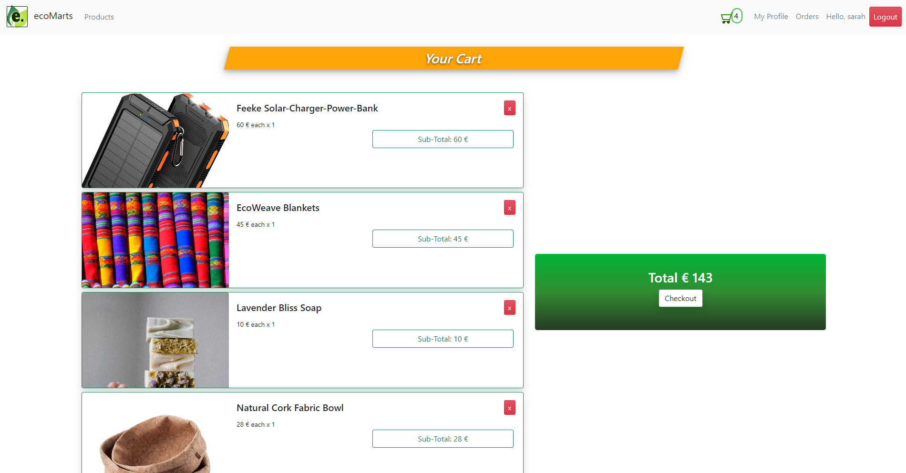

### LifeHacks
This project is a lifehack sharing website that allows users to register and create an account to post and share lifehacks.

Frontend: Handlebars, HTML, CSS, Bootstrap  
Backend: Node.js, Express, MongoDB (Compass and Atlas), Mongoose, Cloudinary

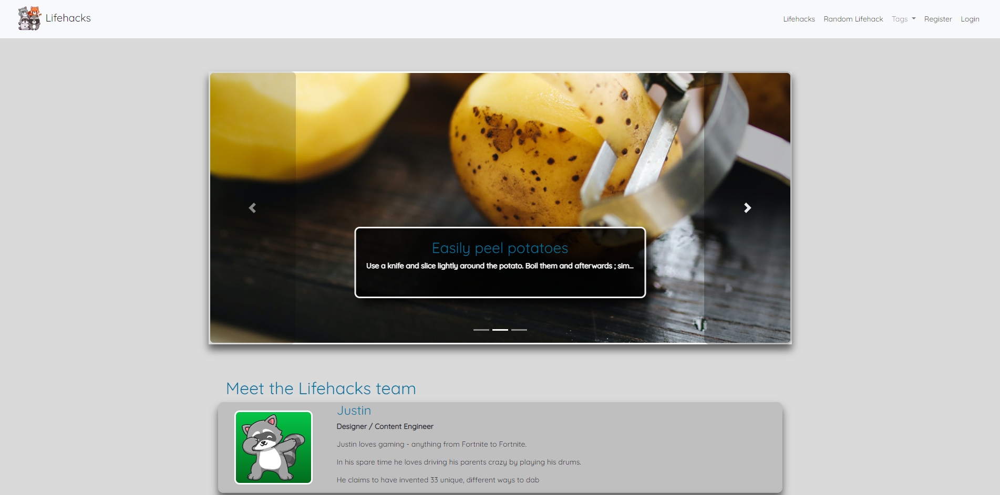 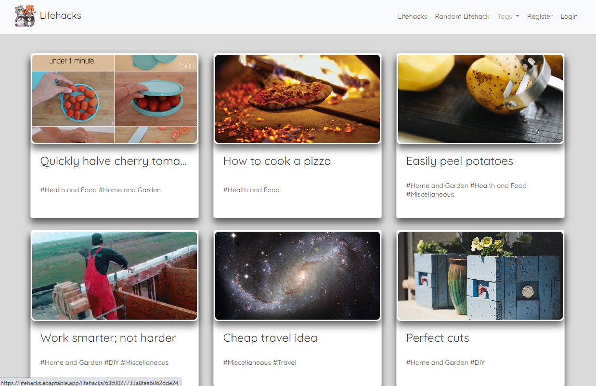 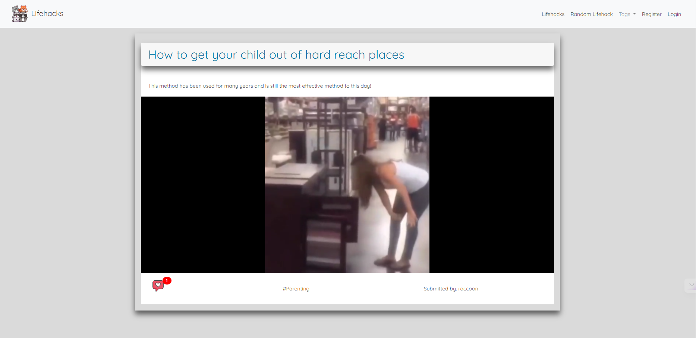

### Raccoons Attack
OOP DOM manipulation game.

- Collision Detection with enemy bombs  
- Shooting of enemy planes (score points for doing so)

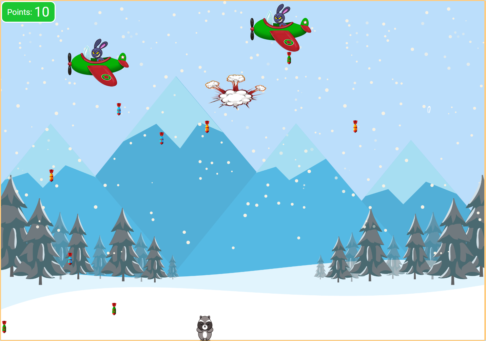 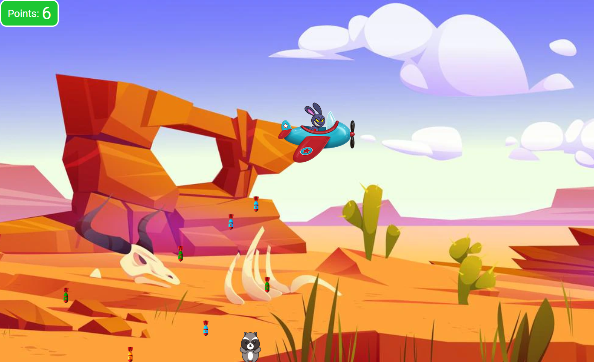 

### Languages and Tools

